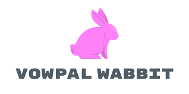

# VW Parallel parsing improvements

## About the program (from website):

The [Reinforcement Learning (RL) Open Source Fest](https://www.microsoft.com/en-us/research/academic-program/rl-open-source-fest/) is a global online program focused on introducing students to open source reinforcement learning programs and software development while working alongside researchers, data scientists, and engineers on the [Real World Reinforcement Learning](https://www.microsoft.com/en-us/research/project/real-world-reinforcement-learning/) team at Microsoft Research NYC. Students will work on a four-month research programming project during their break from university (May-August 2021). Accepted students will receive a $10,000 USD stipend.

Our goal is to bring together a diverse group of students from around the world to collectively solve open source reinforcement learning problems and advance the state-of-the-art research and development alongside the RL community while providing open source code written and released to benefit all.

At the end of the program, students will present each of their projects to the Microsoft Research Real World Reinforcement Learning team online.

## Project Abstract:
Example parsing is an expensive part of VW training pipeline. Support for parallel parsing of text input was contributed last year, but it doesn’t support the more efficient cache format.

- **Goals**: Design and implement an extension to the cache file format to support efficient parallel parsing.

- **Outcomes**: Ability to utilize multicore machines more effectively when training with cache format.

## Code:
All the work can be found here in the form of pull requests. [link](https://github.com/nishantkr18/vowpal_wabbit/pulls).