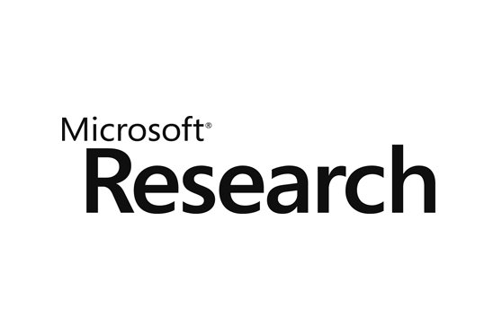
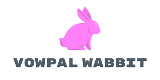

[Presentation link](https://docs.google.com/presentation/d/1SXanD0kRcpRYMmKSy1oy-NWq81bb_PcuzNlCVO9K8u8/edit?usp=sharing)

## About the program (from website):

The [Reinforcement Learning (RL) Open Source Fest](https://www.microsoft.com/en-us/research/academic-program/rl-open-source-fest/) is a global online program focused on introducing students to open source reinforcement learning programs and software development while working alongside researchers, data scientists, and engineers on the [Real World Reinforcement Learning](https://www.microsoft.com/en-us/research/project/real-world-reinforcement-learning/) team at Microsoft Research NYC. Students will work on a four-month research programming project during their break from university **(May-August 2021)**. Accepted students will receive a **$10,000** USD stipend.

Our goal is to bring together a diverse group of students from around the world to collectively solve open source reinforcement learning problems and advance the state-of-the-art research and development alongside the RL community while providing open source code written and released to benefit all.

At the end of the program, students will present each of their projects to the Microsoft Research Real World Reinforcement Learning team online.

## Project Abstract:
Vowpal Wabbit is known for its blazing-fast performance. However, VW's parsers can be a bottleneck for most operations, so an effective way to multithread the parsers is required to unleash their true potential. Last year, parallel parsing support for text input format was provided. This project builds upon that by providing a better and more efficient way to read and write cache, support for multiple passes, multiline examples, and JSON/DsJSON input formats.

- **Goal**: Design and implement an extension to the cache file format to support efficient parallel parsing.

- **Outcome**: Ability to utilize multicore machines more effectively when training with cache format.

## Work done:
All the work can be found here in the form of pull requests. [link](https://github.com/nishantkr18/vowpal_wabbit/pulls). Look at [how to run](htr/htr.md) for more details.

## Pages:
* [How to run](htr/htr.md)
* [Previous work](prev_work/prev_work.md)
* Major changes made:
    * [Relocations](changes/changes.md)
    * [Cache](cache/cache.md)
    * [JSON](json/json.md)
* [Benchmark results](result/result.md)
* [Plans for future](fw/fw.md)
* [Blog](blog/blog.md)

## Resources:
These resources could be helpful for getting started with multithreading in c++.

- [link 1](https://youtube.com/playlist?list=PLk6CEY9XxSIAeK-EAh3hB4fgNvYkYmghp)
- [link 2](https://www.youtube.com/playlist?list=PL1835A90FC78FF8BE)

## Lessons learnt the hard way:
- There can be huge performance differences between the debug and release build. So, we make sure to run all benchmarks on the release build.
- Using a tool like valgrind slows down the program a lot, so the CPU waiting time for lock contentions cannot be studied properly.
- CPU time benchmarking results may vary across datasets.
- Sometimes, an average of `100` runs may not be enough to get an accurate estimate of time taken by the CPU.

## Contribute?
Please feel free to contribute by making pull requests or opening issues on the [repo](https://github.com/nishantkr18/vowpal_wabbit/). I would also love to hear your thoughts about this project. Please use any form of contact mentioned on my website or github bio.

## Acknowledgement:
This summer (the summer of 2021) was a great time for me. Along with all the technical learnings, the most important skill that I learnt was *time management*. 

I would like to thank my mentors [@peterychang](https://github.com/peterychang/) and [@jackgerrits](https://github.com/jackgerrits), for their constant support and guidance. Also, thanks to [@shivanshs9](https://github.com/shivanshs9) for his feedback on the proposal.

Lastly, thanks to Microsoft for this amazing oppotunity and the generous funding.

This has been a summer worth remembering!
