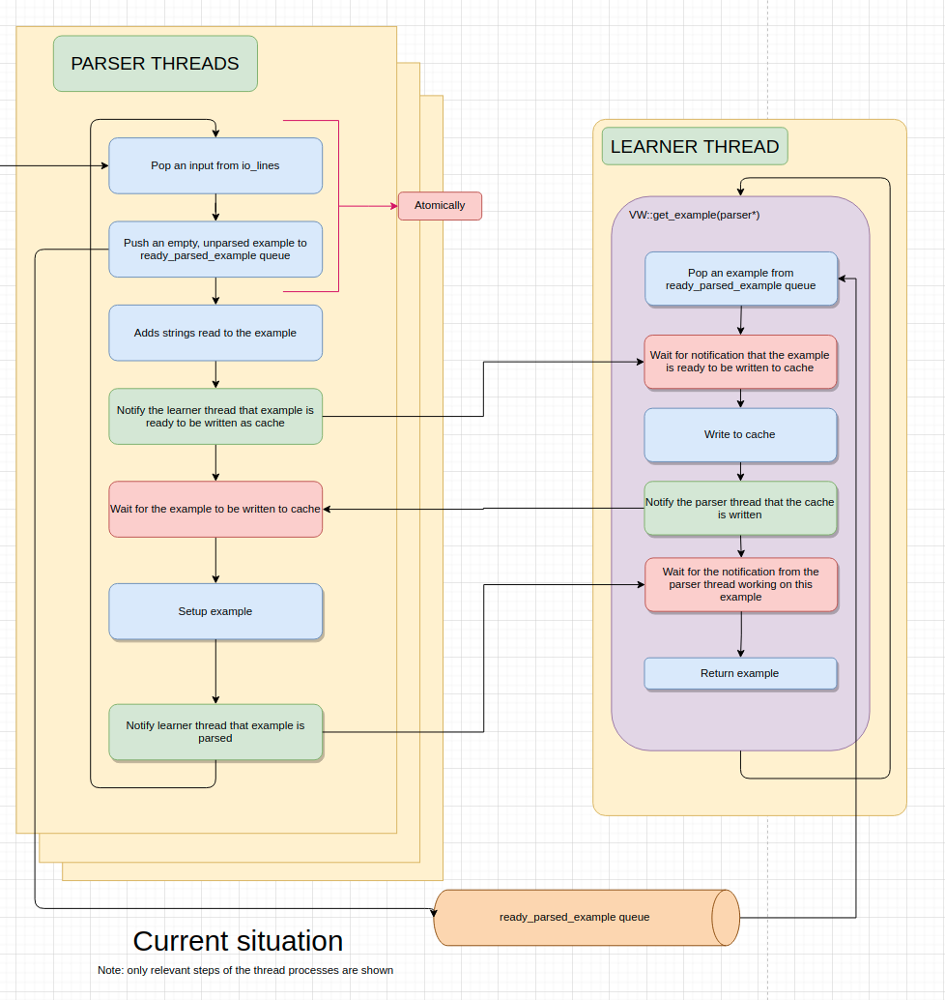

## RLOS summer blog

This page contains work updates when:
* Major milestones were achieved.
* A large part of the day was spent on a problem.

Basically, it contains the highlights of the project.

### 16th May 2:21 am:
* Moved cache writing from the parser threads to the learner thread. The following flow was constructed:

### 16th May 8:40pm

* On comparing the written cache file produced by the code of last commit, to the original vw, the cache files were not same. So, spent the entire time trying to debug.
* What works before last commit:
    * Single thread writing works (cache file is the same as that of original vw) 
    * Multithread gives writing error.
* What works after last commit:
    * Both single and multithread dont work. There are no errors, but the cache files are not the same as that of original cache.

### 18th May Tuesday

* Spent almost the entire day working on RLOS but failed:
    * Trying to get passes part for multithreaded parsers ready, but failed.

### 20th May Thursday 10am (2 hr 15 min)

* Tried to ensure that a single parser thread executes the else block in the parser_dispatch_loop. Asked direction from mentors.

### 20th May Thursday 10:15pm (~2 hrs 30 mins)

* Cache writing part done for single thread.

### 21st May Friday (almost full day)

* Pool object error removed by carefully disposing the example.
* cache parser almost ready 
* Made sure that:
    * Without “-k, -c, --passes”:
        * --num_parse_threads=1 **works**
        * --num_parse_threads=10 **works**
* Completed the cache reader, but there was a bug in reading, probably related to buffer.
* Tried finding out the error in cache reader, but couldn't.

### 22nd May Saturday (~2 hrs 30 mins)

* Fixed a bug in cache writer.
* Tried finding the bug in cache reader, but couldn't.

### 27th May Thursday 

* Bug found by Peter. Solved that, now probably the cache reader works with no issues.
* Checked if passes work (after getting read cache ready):
    * Single thread multiple passes: works sometimes (contention when passes > passes_allowed)
    * Multi Thread multiple passes: works, but output is inaccurate sometimes
* Tried solving the issues, but failed.

### 9th June Wednesday

* Tried to incorporate yesterday’s solutions discussed on chat, but found more and more contentions.

### 10-11th June Thursday-Friday

* Made a separate branch, with a much simplified structure (moving the pass logic to the learner thread)
* Solved the issue of using shared data in setup examples, by moving that logic to the learner thread.
* Also separated the io_lines.pop() and other functions, from the reader function, thereby solving the cache “-k” option, which requires a change of the parser type.

### 14th June Monday

* Understood how JSON parsing works.
* Made it (single line multiple example which is the speciality of JSON) work, but order is lost for multiple parser threads.

### 16th June Tuesday

* Using a queue of vector of examples as the ready_parse_examples queue, to add support for JSON and DSJSON type examples, which can contain multiple examples in a single line.

### 16th July Friday

* Questions:
    * How to run a single test case? How to run a single test file?
    * Solving the multi_example_handler error.

### 19th July Monday

* Tried to solve the problem of multi_examples (optimizing it to reuse the example vectors). Looks like I might need help from Peter.
* Added some tests for the io and parser threads.
* Added time measuring tests to find out how well the parser performs for multithreading.

* TODO:
    * Test using multiple passes and using cache.
    * Test using JSON parser \
	

### 24th July (Saturday):

* Thought of doing individual thread test on cache, but turned out to be not quite straightforward.
* Started using clusters to run tests (64 threads, 32 cores!)
* Used Callgrind to find which functions took the most CPU time
* Making scripts to perform tests on clusters

### 25th July (Sunday)

* Finally concluded that character length of examples determine the time taken by the parser.
* Added results to ppt

### 30th July (Friday)

* Added results of cache and JSON to ppt.
* Tried improving cache performance(trying out calgrind to check where it slows down).

### 31st July (Saturday)

* Ran all tests, finalized them, iterated and finally chose graphs for text, json and cache for 2 types of datasets.

### 8th August (Sunday)
* Almost entire week spent on preparing the blog, website and ppt.