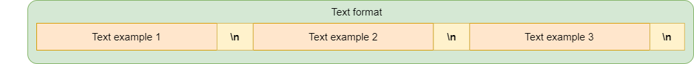
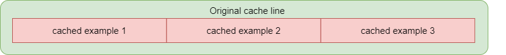
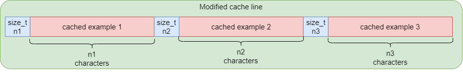
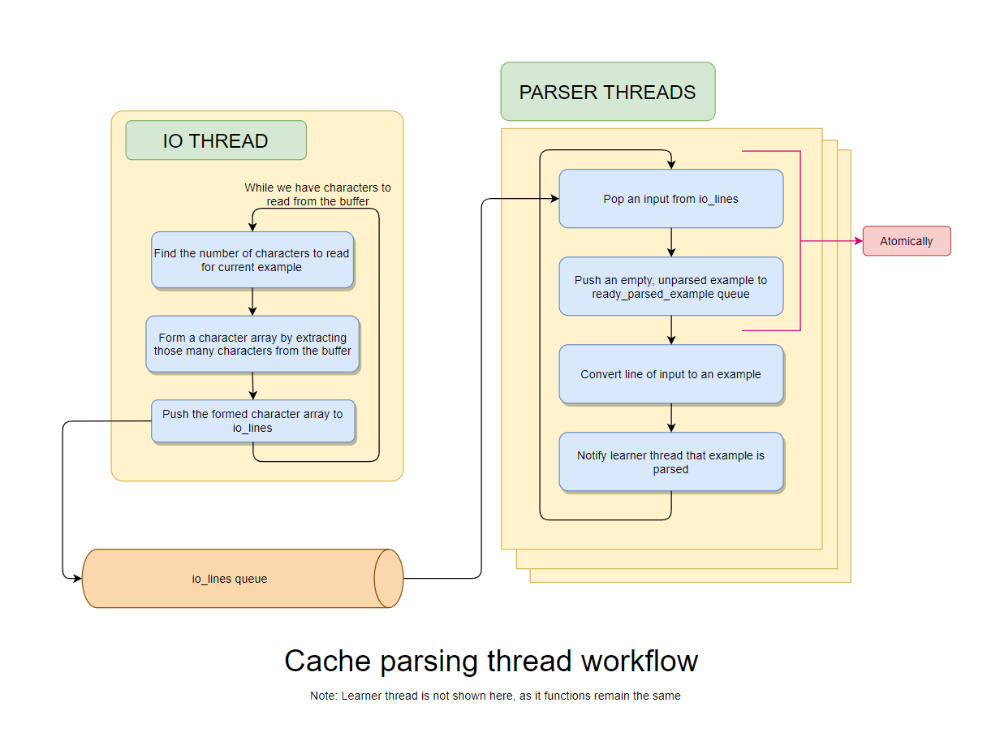

# Cache reading and writing

*This page discusses the changes made to the cache reader and writer, to enable multithreaded parsing of cache.*

## Problem:
The difficulty with the cache input is that this input is of binary format. Therefore, as opposed to the ascii input (text and JSON), there is no end-of-line delimiter to tell us the end of the section of input that should be converted to one example. Therefore, to know how much input to read and parse into one example, we have to actually parse the input used for one example. Therefore, we will not be able to push in chunks of input each corresponding to one input for the cache format, with the current framework established.
 

## Solution:

In order to let the cache parser know the number of characters to read for an example, we prepend a placeholder `size_t` to each example written in cache. This placeholder contains the number of characters in the current example. 

## Cache writer:

Initially, the writer used to directly add the characters parsed to the cache file. But this cannot be continued now, since the example size needs to be "prepended" to the example. Hence, instead of flushing the buffer(writing to file) arbitrarly according to the internal io buffer, we now flush the buffer only when a single example is parsed, and we have the total length of the example recorded.

## Cache Reader:

Once we have cache written this way, we just need to add a special "number of characters" reader in the IO reader for cache, which will populate the `io_lines` queue by reading characters according to the prepended size before each cache example. 

