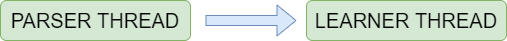

# Relocation
*This page discusses the major relocations of functions, required to handle race conditions.*

The following functions were moved from the parser to the learner thread:

* **Pass counting logic**: It makes sense to move the pass counting logic out of the parser thread, because ideallly the parser should work independently of the current pass count. Also, to make it work on multiple parsers, we needed to make sure that only one of the parsers execute this at a time, while the others kept waiting for it. This involved a using a lot of mutexes and conditional programming. We even made a rough implementation, but it was tough to maintain as the structure became too rigid. Hence, we finally concluded that it would be best to move the logic to the learner thread.

* **Setup examples**: The `setup_examples` function contains a lot of operations which deal with shared data. 

* **Cache writer**: is used to write cache to the outbut buffer. Since this is an IO operation, it needs to be performed atomically. Since, it is a part of the `setup_examples` so we could easily move it to the learner thread.

### Future work:
Since these functions are still a preprocessing step (cache writing is an IO operation), we may want to spawn a separate thread to handle these operations. This would reduce the bottleneck on the learner.