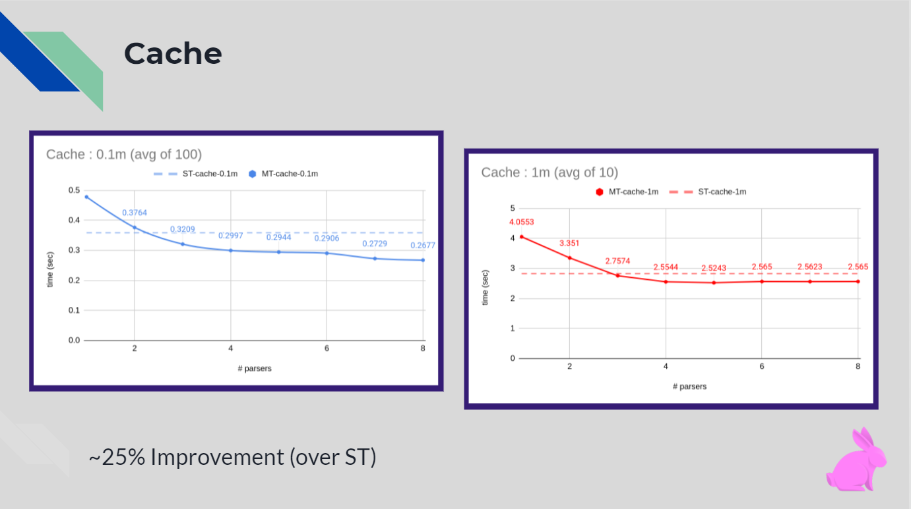
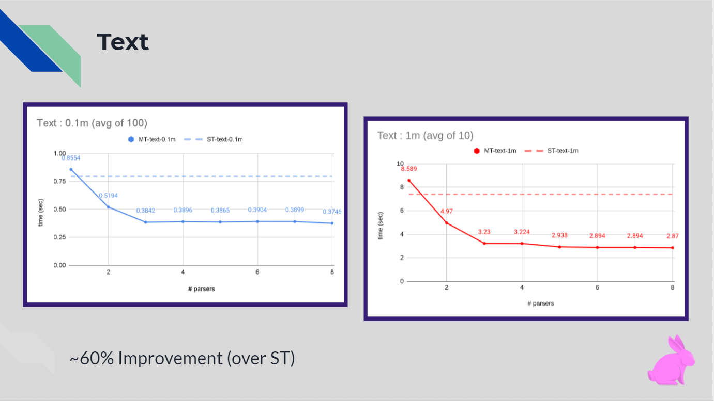
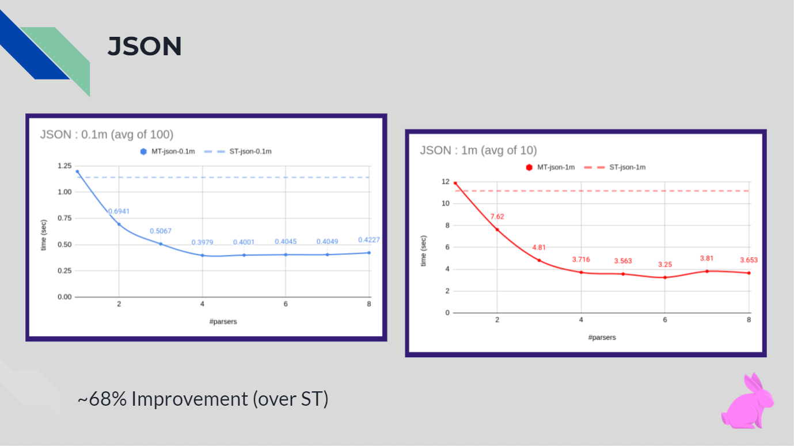
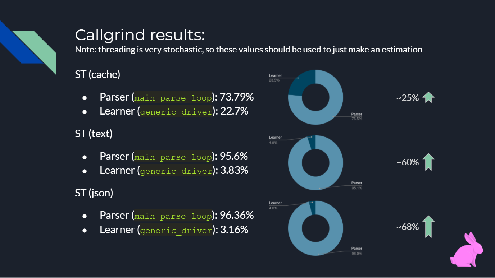

# Benchmark results:
*This page includes screenshots from the presentation, containing benchmark results.*

## Nomenclature:
* **ST : single thread** : refers to the original VW master branch : contains single parser thread.
* **MT: multi thread** : refers to the multithreaded parser version : contains an IO, a parser, and a learner thread
* **0.1m**: stands for 100,000 samples.
* **1m**: stands for 1,000,000 samples.

## Other details:
* The results are averaged over 10/100 runs, with 0.1 secound sleep between successive runs.
* Benchmarks are made on the release build.
* A 32 physical core machine was used.

## Graphs:
 
 
 

## Callgrind results:
The following image shows results from a callgrind run on ST for the three datasets. Callgrind is a tool which helps in identifying the total CPU time taken for each of the functions in a program.

 

From the results, we see that the cache parser is the fastest, followed by Text, which in turn is closely followed by JSON.

This explains why we see the highest improvement in performance over ST for JSON(`68%`) compared to Text(`60%`) and cache(`25%`).