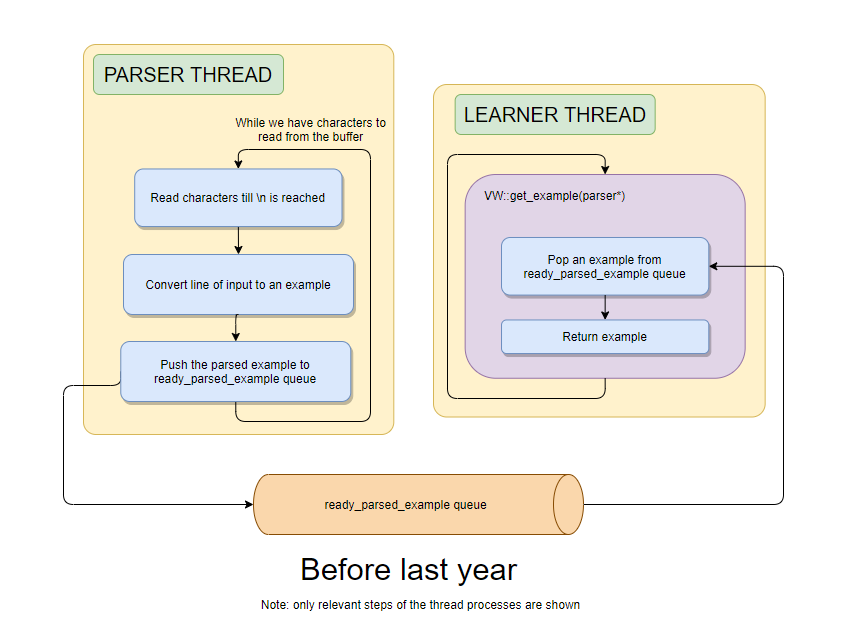
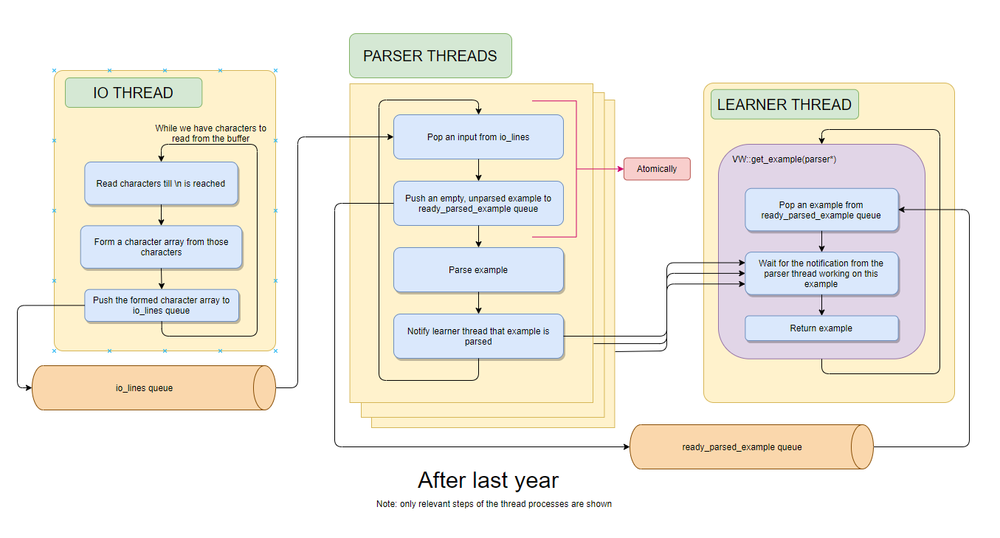

# Work done so far:
*Since this project is a continuation of the previous year’s RLOS project, this section describes last year’s project in brief.*

The major contribution of last year’s project was parallelizing the parser for the text input format. The
following points try to summarize the workflow:
* Previously, the parser thread had two jobs: reading from the buffer and parsing the read lines. Now,
it only has to parse, because the reading job is taken care of by a separate I/O thread.
* With the reading job performed by the I/O thread, the parsing can safely be multithreaded.
* To maintain the ordering of the original data file:
    * I/O and parser threads communicate via a thread-safe queue implementation
    * An empty, unparsed example is added to the ready_parsed_examples queue as soon as a line was popped from the io_lines queue. Both of these take place atomically.
    * The learner will then have to wait for the example in the ready_parsed_examples queue to be flagged as parsed, before continuing.

For More details, please refer: https://github.com/cassmarcussen/vowpal_wabbit/wiki